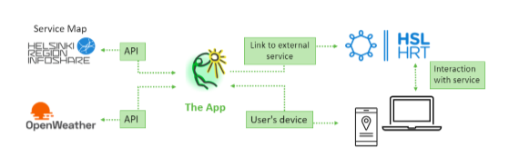
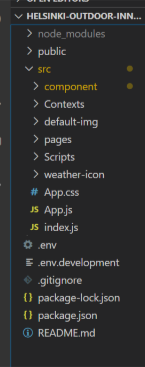
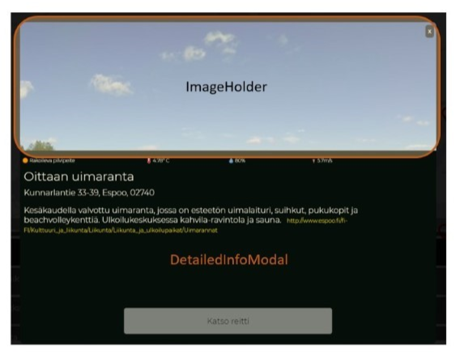
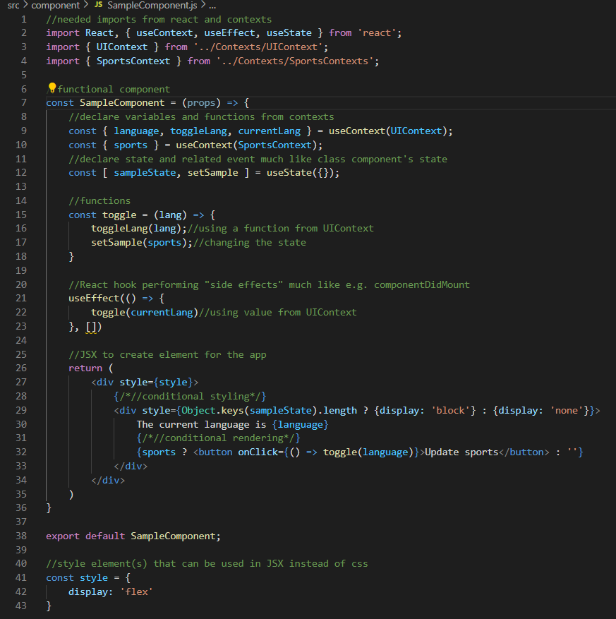
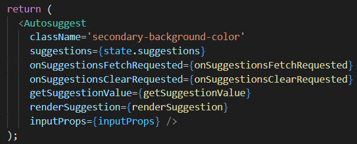
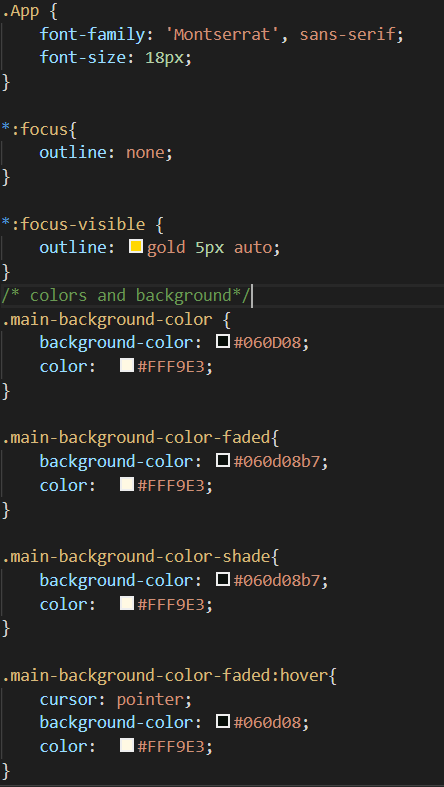
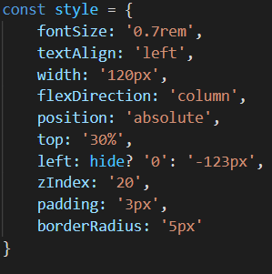
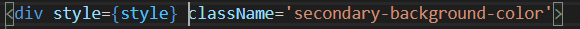
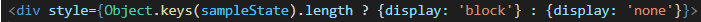

# Ulkoillen - Outdoor Exercise App for Helsinki Metropolitan Area

## Introduction 

Ulkoillen is a single page React app making use of two third-party APIs. Therefore, the app itself does not have a back end and this documentation only covers the app front end and interactions with the APIs. 

## App structure 

Image 1. App architecture diagram 

The grand-scale architecture of the app is as follows: The user uses Ulkoillen app, which serves content from Servicemap API and OpenWeather API for the user. The user can also be redirected to another service for routing information (HSL Reittiopas) if they so wish. [Image 1] 

### React and Context API 

From React 16.8 onwards functional components and hooks have been more supported than the formerly popular class components with their useful lifecycle methods and component state. Some lifecycle methods have even become deprecated of late, making using them unsafe. From React 16.8 onwards React has offered hooks replace those, and this is the technology used on this app. The app also makes great use of Context API, React’s in-built state management tool. It resembles Redux but is a lot less heavy option for global state management and allows the app to make significantly less API calls while sorting the results locally inside context. 

### Folder structure 

Being a React app, the relevant content mainly exists in the src folder. This documentation also concentrates on that folder. [Image 2]

Image 2. Project folder

App.js and Index.js are the engine of a React app. App.js renders the contents of the app and index.js places the App component on the index.html page.  

App.css defines some global styles, for example, font family, but rest of the styling is done in style objects inside components or in some cases, component-specific CSS files. 

As can be seen in the picture (reference) the contents of the app have been allocated into different folders based on their purpose. Starting from the top, components folder contains all components of the app and all CSS files related to a component. 
 
Contexts folder contains React contexts that are used for state management. This app has five context providers in five separate JS files: CurrentSearchTermContext (keeps track of the search words), ServiceContext (gets and stores the services to be show on the map), SportsContext (gets, stores and sorts in several ways the sports to be shown on the map), UIContext (keeps track on UI settings, like filter parameters and language) and WeatherContext (gets and stores weather data).  

Default-img folder contains all icons and images except the weather icons. 

As can be seen, this single page app has ”pages” that are in a separate folder. These are components that are immediate descendants of App.js and are rendered through React Routes based on location pathname.  

Scripts folder contains API call functions used in contexts and components.  

Weather-icon folder contains all weather icons of the app. 

### Component hierarchy 

As typically in React, all components of the app are nested inside App component. The pages, mentioned in the previous chapter, are rendered through React router and they each have children they render themselves. The following chart [Image 3] illustrates the components’ relationships to one another. 

Image 3. Component tree of the app 

Next pictures [Images 4-7] visualize how these elements are located in the UI. 

As can be seen from the diagram and pictures, MiniWeather component is added as a child to every page view instead of App.js. In the following picture [Image 4] it can be seen how Search renders Filter component instead of AutosuggestInput (compared to the picture of result page [Image 5]). 

Image 4. Landing page components in place 

In the next picture [Image 5] it can be seen how Search looks when it renders AutosuggestInput, but there is no input in the field. ServiceToggle does not render conditionally, but the style changes so that the element is hidden. Leaflet-based map component MapView renders the same list of locations as ResultList and their children – LocationMarkers and ResultItems – trigger the same event on click. 

Image 5. Result page components in place 

The next picture [Image 6] depicts DetailedInfoModal as rendered when user clicks either LocationMarker or ResultItem. The button prompts user about continuing to an external service and opens HSL route planner to a new tab. The component will not render ImageHolder component id the location data has no image. 

Image 6. Info modal of a location 

In the WeatherPage [Image 7], the background image is in fact rendered by the CurrentWeather component. FutureWeatherHolder works as a container element for two arrays of FutureWeather components. 

Image 7. Weather page components in place 

## Components 

This chapter presents the general structure and usage of React components in this app, but does not go through all of them, since there are over 15 components in this app. 

### Structure 

The basic structure of the components in this app can be seen in the SampleComponent in the picture below [Image 8]. First there are the needed imports from React, contexts and other locations. Then the component is declared as an arrow function and possible props are passed into it. If the component uses something from the contexts or has a state of its own, they are declared in the beginning of the component. Component’s functions are declared after those. Any functions that should be run whenever the component is rendered, should be called before the return statement, like useEffect hook in the example. UseEffect is used to perform “side effects” that run only once when component renders, much like lifecycle method componentDidMount on a class component. Return statement returns the JSX block that is rendered into HTML on the actual page. JSX is very similar to HTML but has some very profound differences, like possibility to have JS script inside JSX element. In this example that type of script can be seen written inside curly braces on line 32. In most components style objects are located after exporting the component. They can, however, be declared inside the component, too. They are used in styling the component through style-attribute and have replaced CSS in most components of the app. 

This structure is used as applicable. 

Image 8. Sample of a React component structure used in the app 

### Leaflet map and markers 

The map component is rendered by React-Leaflet library. It takes coordinates and zoom level as parameters to define the center point for the map. The base map layer in this application is the same as in Ulkoliikunta.fi service. Location markers are also a part of the React-Leaflet library. LocationMarkers are rendered in the MapView component, where the search results are mapped and added to the map layer based on the coordinates of those locations. By clicking the markers, the user can see additional information about the places in a popup/modal. 

Markers are also used to point different services, like playgrounds, public transport stops, parking, and toilets. Custom markers are used for the different services for the user to distinguish them from each other. The user can easily toggle which services they want to see on the map. 

### Autosuggest 

The Autosuggest component inside AutosuggestInput is a customized version of an open-source component by a GitHub user. Provided package contains the Autosuggest component as a component to be imported, requiring the attributes shown in the following image [Image 9]. In addition to that, for autosuggest to work it needs to make use of several functions, all of which are also provided in the GitHub repository. Main changes to the original code were altering the component to use Context API state values instead of component state and the effects of choosing a suggested search word. 

Image 9. Autosuggest component in use 

## API calls 

The API calls are done using axios. These functions are all located in Scripts-folder and are imported when needed.  

Weather is requested from OpenWeatherMap API by city name and by coordinates for each outdoor sport venue. Weather API needs an API key that was acquired by registering into the service. The free version used in the app for now limits the number of API calls. The limit is sufficient for development, but will quickly be reached with a published app. Therefore, it is recommended to update it for possible launch. 

Outdoor sports venues and services are obtained from City of Helsinki Service Map REST API. This API contains plenty of information in addition to sports venues and is catalogued with ontology names. Therefore, the sports are requested with dozens of different ontologies that are tied into 29 separate functions. Services are obtained by only five functions. 

## Styling 

The current application is designed for both mobile and desktop view, with minimum width being capped at 320px and no upward limit. It also utilizes both CSS stylesheet and style objects for styling the application. 

### CSS Stylesheets 

CSS Stylesheets include the App.css [Image 10], which covers the styling for some general elements in this application - button, paragraph, background color, fonts, hover, scrollbar, etc - these are generic and universally used for a variety of elements.  

Image 10. Snippet from App.css  

Other stylesheets such as Autosuggest.css or CurrentWeather.css cover the stylings for individual React components - they must be imported in the React component before usage. 

These files can cause some cross-component styling mishap (such as styling in AutosuggestInput.css can affect styling in CurrentWeather.js) so it is recommended to refactor them to style objects in the corresponding components. They were created quite early in development and there is no current bug concerning them, so they fall into the lower priority during development. 

### Style objects 

Style objects are one way to use CSS styling in React. Style objects are essentially JS objects that have key-value pairs corresponding to CSS attributes. [Image 11] 

Object stylings are used quite commonly during the latter half of development, which help the stylings of each component separated and the folder hierarchy clean (no JS and CSS files sharing the same folder). 

Image 11. Style object and use of the object 

### Inline styling 

At times, the style object of an element is so simple, or the conditional change is so small that it is more convenient to write the JS object directly into style attribute. In the following code snippet [Image 12] from SampleComponent, conditional styling has been implemented with inline styling instead of style objects. 

Image 12. Inline styling with condition 

## Important references 

React-Leaflet library used for the map view: https://react-leaflet.js.org/ 

Pre-made autosuggest component: http://react-autosuggest.js.org/ 

OpenWeatherMap API documentation: https://openweathermap.org/api 

City of Helsinki Service Map REST API documentation: https://www.hel.fi/palvelukarttaws/restpages/ver4.html 

Repository of the existing Palvelukartta: https://github.com/City-of-Helsinki/servicemap-ui 